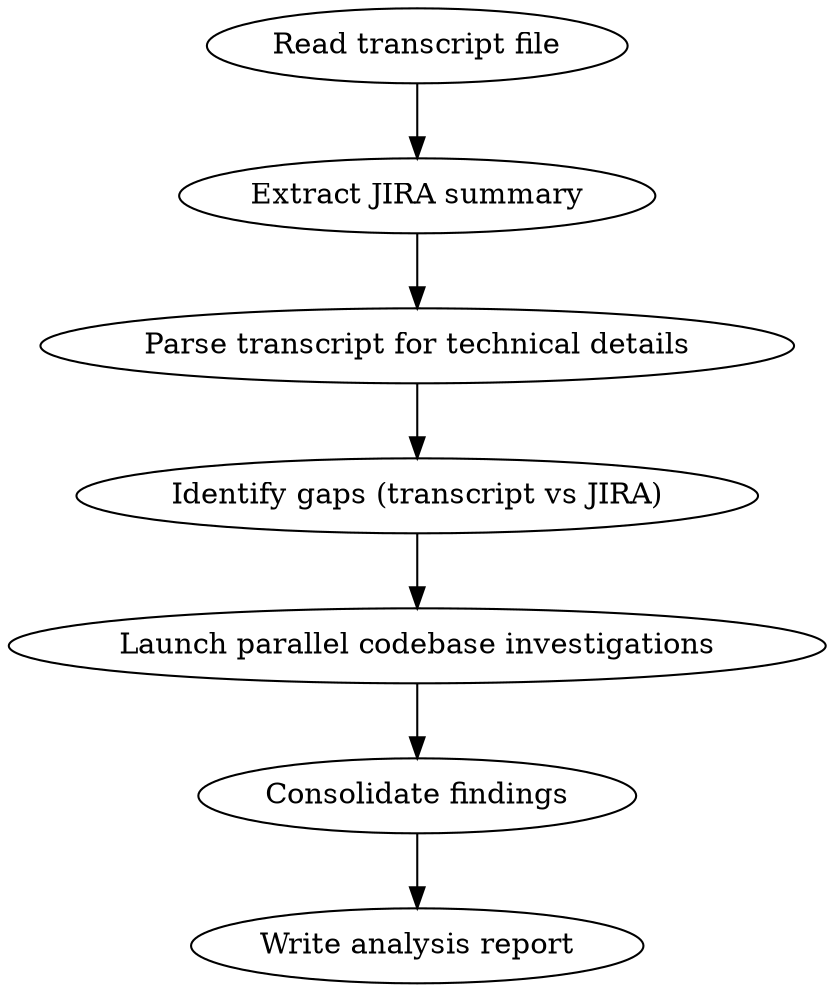

# Analyzing Meeting Transcripts

## Overview

Extracts actionable technical details from meeting transcripts that haven't been captured in JIRA tasks, then investigates the codebase to validate assumptions and identify implementation touchpoints.

## When to Use

- User provides a markdown file containing JIRA info and meeting transcript
- User asks to analyze a meeting recording/transcript against a task
- User wants to extract missing details from a planning discussion

## Workflow



## Step 1: Read and Parse the Input File

The input file has two sections:
1. **Meeting transcript** - Raw conversational text (may be messy/unformatted)
2. **JIRA information** - Structured task details between `<!-- JIRA_INFO_START -->` and `<!-- JIRA_INFO_END -->`

**Transcript parsing tips:**
- Speakers are not labeled; use context clues to follow conversation
- Technical terms and code references are key signals
- Look for decisions, rationale, and "we agreed" statements
- Note file names, function names, and IDs mentioned

## Step 2: Identify Gaps

Compare transcript content against JIRA task. Look for:

| Category | What to Extract |
|----------|-----------------|
| **Implementation details** | Specific fields, column names, data types decided |
| **Rationale** | WHY decisions were made (not just WHAT) |
| **Scope limitations** | What's explicitly OUT of scope |
| **Edge cases** | Specific scenarios discussed |
| **Code locations** | Files, classes, functions mentioned |
| **Migration/backfill** | Data migration details, record counts |
| **Caching/performance** | Caching strategies, invalidation needs |
| **Dependencies** | What must happen before/after |

## Step 3: Launch Parallel Codebase Investigations

Use the Task tool to spawn parallel Explore agents. Each agent should:
- Focus on ONE specific area from the transcript
- Return file paths, line numbers, and short descriptions
- NOT attempt implementation
- Validate or invalidate assumptions from the meeting

**Standard investigation areas:**

1. **Database/Models** - Entity classes, DAOs, mappers, migrations
2. **Controllers/APIs** - Request handlers, admin pages, API endpoints
3. **Hard-coded logic** - Constants, enums, special-case handling
4. **UI/Views** - Admin forms, dropdowns, templates
5. **Caching** - Cache keys, TTLs, invalidation patterns

**Agent prompt template:**
```
Investigate [AREA] in [CODEBASE_PATH].

Context from meeting: [RELEVANT DETAILS]

Your task:
1. Find [SPECIFIC THINGS TO LOOK FOR]
2. Understand how [CURRENT BEHAVIOR WORKS]
3. Identify files/functions that would need changes

Return a report with:
- How the current system works
- List of files, line numbers, function names that need editing
- Format: file path : line number - function/class - short description

Do NOT write any code, just research and report.
```

## Step 4: Consolidate and Write Report

Create a markdown report with these sections:

```markdown
# [TICKET-ID] Technical Analysis Report

**Task:** [Summary from JIRA]
**Date:** [Today's date]
**Source:** Meeting transcript analysis + codebase investigation

---

## Executive Summary
[Key findings in 3-5 bullets]

## 1. [Topic Area from Investigation]
### Current State
[How it works now]

### Files to Edit
| File | Lines | Class/Method | Change Required |
|------|-------|--------------|-----------------|
| path | 1-10 | ClassName | Description |

## 2. [Next Topic Area]
...

## Assumptions Validated
| Assumption from Meeting | Status | Evidence |
|------------------------|--------|----------|
| [What was said] | Confirmed/Invalidated | [What we found] |

## New Information Discovered
[Things found in codebase that weren't discussed]

## Implementation Order Recommendation
1. First thing
2. Second thing
...
```

## Output Location

**ALWAYS write the report to the same directory as the input file.**

Given input file: `/path/to/recordings/GT-1234.md`
Write output to: `/path/to/recordings/GT-1234-Analysis.md`

Extract the ticket ID from the input filename and append `-Analysis.md`.

## Common Patterns to Look For

**In transcripts:**
- "we agreed" / "let's do" / "the plan is" = Decisions
- "because" / "the reason" / "otherwise" = Rationale
- "we don't need" / "out of scope" / "not for this" = Scope limits
- "what about" / "edge case" / "if someone" = Edge cases
- File/class names, IDs, column names = Technical specifics

**In codebases:**
- Hard-coded IDs or names = Potential maintenance burden
- Missing cache invalidation = Bug waiting to happen
- Inconsistent patterns (some dynamic, some hard-coded) = Technical debt

## Red Flags

- **Transcript says X, code does Y** - Flag as assumption to validate
- **JIRA says "set flag somewhere"** - Transcript likely has specific field name
- **Multiple approaches discussed** - Note which was chosen and why
- **"We'll figure that out later"** - Note as open question
